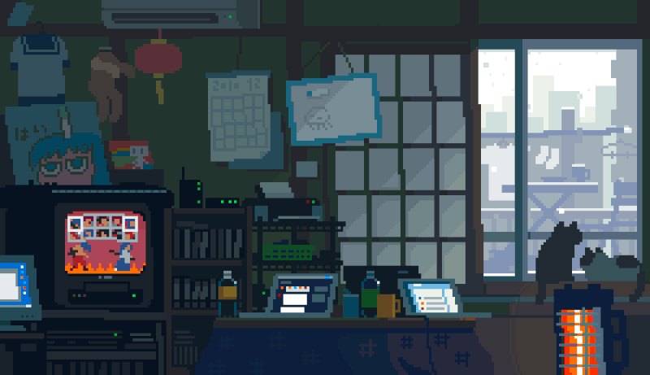

<!-- markdownlint-disable MD033 -->

  

 

 

A passionate backend developer & AI enthusiast dedicated to building robust systems and solving complex problems with modern tech. Welcome to my GitHub profile where I share my creative projects and explorations.

  &nbsp;
  &nbsp;
  &nbsp;

  

<h3>About Me 👨🏻‍💻</h3>

- 🔭 &nbsp; Currently working on **[Voting-System](https://github.com/Mohammed0572/VotingSystem)**
- 🌱 &nbsp; Currently learning **System Design**, **Cloud Computing**, and exploring **Generative AI & LLM applications**.
- 💬 &nbsp; Ask me about **Java, Python, C++, DSA, React, and AWS** — happy to help!
- 🤔 &nbsp; Passionate about solving real-world problems through **AI, FinTech, and scalable software solutions**.
- 🎓 &nbsp; Pursuing **B.E. in Computer Science and Business Systems (CSBS)**.
- 💼 &nbsp; **Full-Stack Developer**, **Cloud Enthusiast**, and **AI/ML Learner**.
- ☁️ &nbsp; AWS Certified learner with interests in **Cloud Computing, Artificial Intelligence, Machine Learning, and Backend Development**.
- 🏆 &nbsp; Actively participating in **Hackathons**, building innovative projects, and continuously improving my technical skills.
- ✍️ &nbsp; Hobbies: Exploring new technologies, contributing to open-source projects, and designing impactful software.
- ☕ &nbsp; _I believe every great idea starts with curiosity, consistency, and a good cup of coffee._

<h3 align="center">My Projects 🚀</h3>

<table>
  <tr>
    <td width="50%" valign="top">
      <h4>DSA-HUB 📚</h4>
      
An interactive educational web app to help students master Data Structures and Applications. Features modern UI with C source code viewer and browser-based algorithm simulations.

      

        
        
        
      

      &nbsp;
      
    </td>
    <td width="50%" valign="top">
      <h4>CryptVault 🔐</h4>
      
A hybrid C++ + x64 Assembly encryption tool with a blockchain-backed tamper-proof audit trail and P2P multi-user network. Built from scratch with zero external dependencies.

      

        
        
        
        
      

      
Contributors: <a href="https://github.com/supr1795">Supreeth</a> · <a href="https://github.com/Mohammed0572">Syed</a> · <a href="https://github.com/toxicbishop">Pranav</a>

      
    </td>
  </tr>
  <tr>
    <td width="50%" valign="top">
      <h4> Multimodal Blockchain based Voting System 🗳️</h4>
      
A tamper-proof election platform integrating biometric facial recognition with decentralized Ethereum ledgers.

      

        
        
        
        
      

      
Contributors: <a href="https://github.com/supr1795">Supreeth</a> · <a href="https://github.com/Mohammed0572">Syed</a> · <a href="https://github.com/toxicbishop">Pranav</a>

      
    </td>
    <td width="50%" valign="top">
      <h4>Cost of Living in Bengaluru 🏙️</h4>
      
A data-driven React and Express web app for exploring Bengaluru's living costs. Features interactive neighborhood filters, lifestyle calculators, and real-estate insights for students and residents.

      

        
        
        
      

      
Contributors: <a href="https://github.com/supr1795">Supreeth</a> · <a href="https://github.com/Mohammed0572">Syed</a> · <a href="https://github.com/toxicbishop">Pranav</a>

      
    </td>
  </tr>
  <tr>
    <td width="50%" valign="top">
      <h4>Super Duper Barnacle 🚀</h4>
      
A Python tool to automatically generate commits and fill your GitHub contribution graph with green squares. Perfect for showcasing consistent activity or filling in past activity gaps.

      

        
      

      
    </td>
    <td width="50%" valign="top">
      <h4>EventHub 📅</h4>
      
A comprehensive, full-stack event management platform to streamline the creation, discovery, and registration of events. Built with modern web technologies for a seamless user experience.

      

        
        
        
      

      
    </td>
  </tr>
</table>

<h3 align="center">Languages and Tools 🛠:</h3>

<strong>Languages</strong> 
  

<strong>Frontend</strong> 
  

<strong>Backend & Databases</strong> 
  

<strong>AI / ML & Data Science</strong> 
   
   
  
  
  
  
  
  
  
  
  

<strong>Mobile</strong> 
  

<strong>Tools & DevOps</strong> 
   
   
 

<!-- GITLAB_REMOVE_START -->

  &nbsp;&nbsp;

<h3 align="center">Contribution Graph 👾</h3>

  <picture>
    <source media="(prefers-color-scheme: dark)" srcset="https://raw.githubusercontent.com/rohithgaloth/rohithgaloth/output/pacman-contribution-graph-dark.svg">
    <source media="(prefers-color-scheme: light)" srcset="https://raw.githubusercontent.com/rohithgaloth/rohithgaloth/output/pacman-contribution-graph.svg">
    
  </picture>

<!-- GITLAB_REMOVE_END -->
